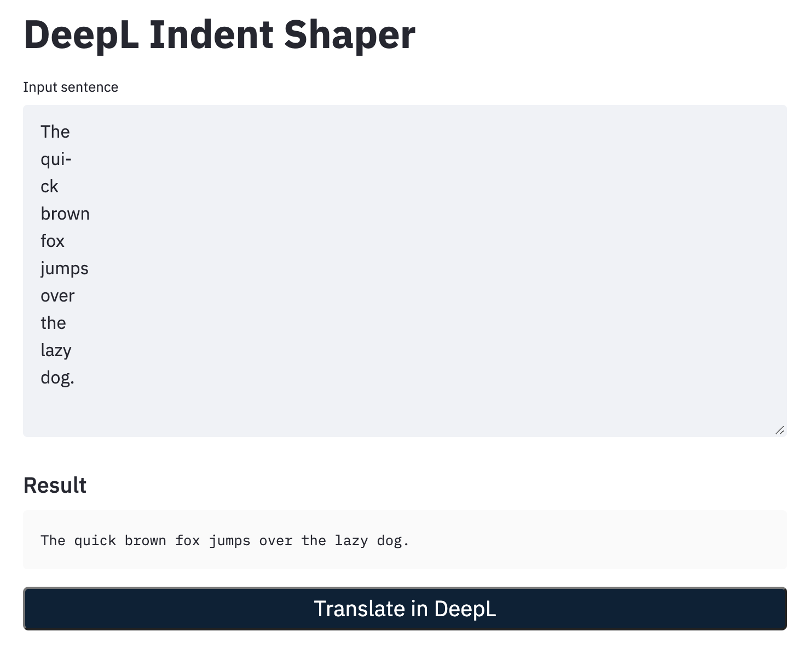

# DeepL Indent Shaper

Fix the indentation when copying from the PDF and translate it using [DeepL](https://www.deepl.com/home).



## How to run

```sh
git clone https://github.com/morioprog/deepl_indent_shaper.git
cd deepl_indent_shaper
pip install -r requirements.txt
streamlit run app.py
```
